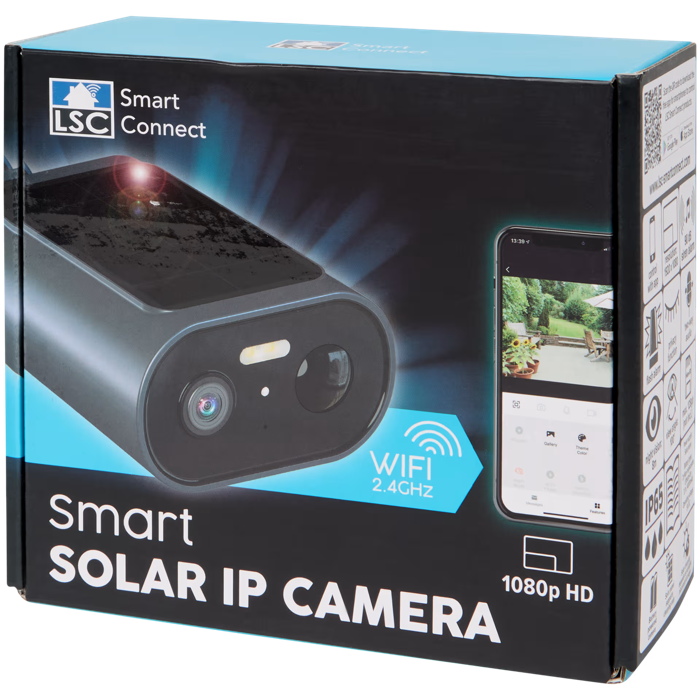

# LSC Smart Connect Solar IP Camera Toolkit

Tools for the Action / LSC Smart Connect solar IP camera, product `3222494`.
The goal is to keep the original Tuya stack working while adding local access:



- root shell over telnet
- RTSP stream on port `8554`
- ONVIF service on port `8899` plus WS-Discovery
- Tuya app still starts normally
- default tweaks for a cleaner local stream, including watermark off

This work started from
[tasarren/lsc-tuya-toolkit issue #16](https://github.com/tasarren/lsc-tuya-toolkit/issues/16)
for the
[LSC Smart Connect solar IP camera](https://www.action.com/nl-nl/p/3222494/lsc-smart-connect-solar-ip-camera/).

## Status

Tested on firmware `6.2712.35` with an Ingenic T23 based camera. Other LSC/Tuya
solar cameras may use different firmware layouts, offsets, or boot behavior.

## Background

The first route was UART with an FT232RL USB-TTL adapter. That exposed useful
boot logs and a Linux login prompt, but the console is password protected. The
root password hash is traditional DES `crypt(3)` and was not cracked.

The working route came from dumping the SPI flash with a CH341A programmer,
unpacking/decrypting the firmware, and finding the SD-card `tuya.dat` import
path. This repository uses that path as a one-time bootstrap: on first boot the
camera executes `firstboot.sh` from the SD card, copies the currently running
Tuya executable from `/proc`, patches the SD-card copy to avoid the low-power
shutdown path that otherwise kills the Linux side, then reboots into the
SD-card factory bootstrap. The original Tuya app still runs from there.

## Safety

This modifies the camera boot flow from an SD card. Test at your own risk and
expect firmware differences across product batches.

This repository intentionally does not include firmware dumps, keys, logs, or
proprietary Tuya binaries.

The patched Tuya binary lives on the SD card; the internal firmware binary is
not overwritten. The bootstrap does set the persistent factory-mode flag
`/config/fmode`, so do not assume that removing the SD card alone is enough to
restore the stock boot path. To revert, clear the flag from telnet, reboot, and
then remove the SD card:

```sh
rm -f /config/fmode
sync
reboot
```

## Prerequisites

- macOS or Linux host
- Docker, for the MIPS cross-compile environment
- FAT32 formatted SD card

## Build

```sh
./tools/compile.sh
```

This builds:

- `aic_filter`: opens TCP forwarding through the AIC Wi-Fi side.
- `stone_dump_relay`: turns the Tuya H264 dump stream into RTSP/raw H264.
- `onvif_cgi_httpd`: small HTTP wrapper for ONVIF SOAP requests.
- `patch_stone_main`: patches the copied Tuya binary to keep Linux awake.
- `onvif_simple_server`: handles ONVIF device/media SOAP calls.
- `wsd_simple_server`: announces the camera via ONVIF WS-Discovery.

The build script fetches pinned upstream sources for
[OpenIPC/smolrtsp](https://github.com/OpenIPC/smolrtsp) and
[roleoroleo/onvif_simple_server](https://github.com/roleoroleo/onvif_simple_server).

## Prepare an SD card

Replace `/path/to/sd-card` with your mounted SD-card path.

```sh
./tools/build_tuya_dat_overflow.py /path/to/sd-card
sync
```

Insert the SD card and boot the camera. On success, the camera should expose:

- telnet root shell: `telnet <camera-ip> 2323`
- RTSP main stream: `rtsp://<camera-ip>:8554/main_ch`
- ONVIF service: `http://<camera-ip>:8899/onvif/device_service`
- raw H264 stream: `nc <camera-ip> 8555 > stream.h264`

Default ONVIF credentials:

```text
admin / admin
```

## Live update over the network

After telnet is working, you can update the SD-card files without physically
swapping the card.

Generate a fresh payload directory:

```sh
rm -rf /tmp/lsc-solar-payload
mkdir -p /tmp/lsc-solar-payload
./tools/build_tuya_dat_overflow.py /tmp/lsc-solar-payload
```

Push it to the camera:

```sh
./tools/push_camera_live.py /tmp/lsc-solar-payload --camera-ip <camera-ip>
```

The live pusher serves small chunks over TFTP, drives the camera over telnet,
reassembles each file on the camera, verifies `md5sum`, then reboots by default.
It does not push `tuya.dat` during normal live updates; use `--include-trigger`
only when deliberately testing the first-boot trigger path.

## What the bootstrap changes

The SD bootstrap currently:

- on first boot, copies the running Tuya executable from `/proc` to
  `factory/stone-main.bin`
- patches that SD-card copy to keep the Linux side awake
- sets `/config/fmode` only after the copy and patch succeed
- consumes the `tuya.dat` trigger after first use
- keeps `/config/fmode` asserted
- starts telnet on port `2323`
- starts the RTSP relay on port `8554`
- starts ONVIF HTTP and WS-Discovery
- applies AIC TCP forwarding filters
- starts the original Tuya process from `factory/stone-main.bin`
- sets these Tuya config values to `0`:
  - `tuya_hum_on_off`
  - `tuya_pir_on_off`
  - `tuya_flip_onoff`
  - `tuya_watermark_onoff`

## Repository layout

```text
tools/build_tuya_dat_overflow.py      SD payload builder
tools/push_camera_live.py             live network updater
tools/compile.sh                      Docker based MIPS build
tools/src/                            small camera-side helpers
tools/patches/                        ONVIF server portability patch
```

## Credits

This builds on prior LSC/Tuya camera work from:

- [tasarren/lsc-tuya-toolkit](https://github.com/tasarren/lsc-tuya-toolkit)
- [guino/LSCOutdoor1080P](https://github.com/guino/LSCOutdoor1080P)
- [OpenIPC/smolrtsp](https://github.com/OpenIPC/smolrtsp)
- [roleoroleo/onvif_simple_server](https://github.com/roleoroleo/onvif_simple_server)
