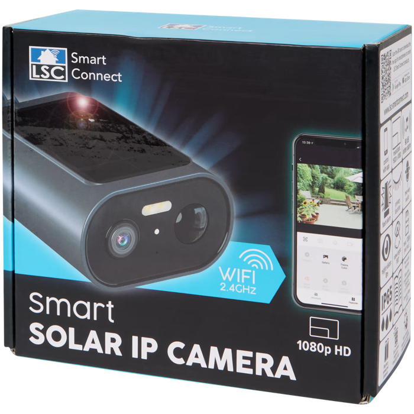

# LSC Smart Connect Solar IP Camera Toolkit

Tools for the Action / LSC Smart Connect solar IP camera, product `3222494`.
The goal is to keep the original Tuya stack working while adding local access:



- root shell over telnet
- RTSP stream on port `8554`
- ONVIF service on port `8899` plus WS-Discovery
- Tuya app still starts normally
- default tweaks for a cleaner local stream, including watermark off

This work started from
[tasarren/lsc-tuya-toolkit issue #16](https://github.com/tasarren/lsc-tuya-toolkit/issues/16)
for the
[LSC Smart Connect solar IP camera](https://www.action.com/nl-nl/p/3222494/lsc-smart-connect-solar-ip-camera/).

## Status

Live-tested on an Ingenic T23 based camera before and after an OTA from
`6.2712.35` to `6.2712.43`. The SD bootstrap captured the newly flashed
executable, discovered its changed patch locations, and brought telnet, RTSP,
ONVIF, and the Tuya live view back after reboot. Other LSC/Tuya solar cameras
may still use different firmware layouts or boot behavior.

## Background

The first route was UART with an FT232RL USB-TTL adapter. That exposed useful
boot logs and a Linux login prompt, but the console is password protected. The
root password hash is traditional DES `crypt(3)` and was not cracked.

The working route came from dumping the SPI flash with a CH341A programmer,
unpacking/decrypting the firmware, and finding the SD-card `tuya.dat` import
path. This repository uses that path as a one-time bootstrap: on first boot the
camera executes `firstboot.sh` from the SD card, copies the currently running
Tuya executable from `/proc`, patches the SD-card copy for the local ONVIF
hooks, then reboots into the SD-card factory bootstrap. The original Tuya app
still runs from there.

## Safety

This modifies the camera boot flow from an SD card. Test at your own risk and
expect firmware differences across product batches.

This repository intentionally does not include firmware dumps, keys, logs, or
proprietary Tuya binaries.

The patched Tuya binary lives on the SD card; the internal firmware binary is
not overwritten. The bootstrap does set the persistent factory-mode flag
`/config/fmode`, so do not assume that removing the SD card alone is enough to
restore the stock boot path. To revert, clear the flag from telnet, reboot, and
then remove the SD card:

```sh
rm -f /config/fmode
sync
reboot
```

Toolkit runtime logs are reset at boot and truncated in place if an individual
log grows beyond 256 KiB. Stock recordings under `DCIM/` are not deleted by the
toolkit and can still fill or corrupt a small SD card; use the app's recording
retention/format controls and keep reasonable free-space headroom.

On a low-power PIR wake, the ONVIF motion state is re-pulsed every 10 seconds
for the active motion window. This gives an NVR time to recreate its PullPoint
subscription after the camera boots instead of missing the initial transition.

## Firmware upgrades

The SD bootstrap no longer pins the first firmware's Tuya executable forever.
The stock boot script starts the SD factory hook in the background and then
unlinks `/stone/main`, so the hook first creates an immediate hard link to that
boot's executable. The entrypoint hashes this preserved file and, when it
changed, patches a fresh SD copy using unique instruction-context signatures
and records the source hash. This has been live-validated across the
`6.2712.35` to `6.2712.43` OTA. That package does not contain a config-partition
image, and the live upgrade confirmed that `/config/fmode` remains effective.

After running `./tools/compile.sh` and extracting another OTA, run the complete
compatibility check before using it on a camera:

```sh
./tools/check_stone_compat.sh /path/to/extracted/rootfs/stone/main
```

This works on temporary copies: it tests low- and high-power patching,
bootstrap-gadget discovery, fail-closed signature handling, and generation of a
complete payload.

If a future executable no longer matches those structural signatures, the
patcher refuses to write at a guessed location. The boot script then runs the
new stock executable unmodified. The Tuya app and local services are still
launched, but RTSP data and patched ONVIF snapshots may depend on behavior that
changed in that firmware. This is deliberately a fail-safe compatibility
policy, not a guarantee that every future firmware can be patched automatically.

## Prerequisites

- macOS or Linux host
- Docker, for the MIPS cross-compile environment
- FAT32 formatted SD card

## Build

```sh
./tools/compile.sh
```

This builds:

- `aic_filter`: opens TCP forwarding through the AIC Wi-Fi side.
- `stone_dump_relay`: turns the Tuya H264 dump stream into RTSP/raw H264.
- `onvif_cgi_httpd`: small HTTP wrapper for ONVIF SOAP requests.
- `patch_stone_main`: discovers and patches the relevant Tuya code by
  instruction context for ONVIF snapshots and can optionally disable the stock
  low-power branch.
- `onvif_simple_server`: handles ONVIF device/media SOAP calls.
- `onvif_notify_server`: tracks ONVIF event state for PullPoint subscriptions.
- `wsd_simple_server`: announces the camera via ONVIF WS-Discovery.

The build script fetches pinned upstream sources for
[OpenIPC/smolrtsp](https://github.com/OpenIPC/smolrtsp) and
[roleoroleo/onvif_simple_server](https://github.com/roleoroleo/onvif_simple_server).

## Prepare an SD card

Replace `/path/to/sd-card` with your mounted SD-card path.

```sh
./tools/build_tuya_dat_overflow.py \
  --stone-main /path/to/extracted/rootfs/stone/main \
  /path/to/sd-card
sync
```

Generating a trigger always requires the exact stock `stone/main` from the
firmware currently installed on the target camera. The builder validates the
overflow layout and discovers the matching bootstrap gadget; it has no raw
address or assumed-version escape hatch. The stock executable is only inspected
on the host and is not copied into the repository or generated payload.

Legacy cards may contain `tuya.dat.used`, a consumed firmware-specific trigger.
Never rename or copy it back to `tuya.dat`, especially after an OTA. Current
payloads delete the trigger as soon as firstboot starts, and the builder removes
legacy `.used` files. A cached `update.bin` identifies an available or downloaded
package, not necessarily the firmware currently installed. If factory mode must
be re-established, determine the installed version and regenerate `tuya.dat`
from that version's exact `stone/main` using the command above.

Insert the SD card and boot the camera. On success, the camera should expose:

- telnet root shell: `telnet <camera-ip> 2323`
- RTSP main stream: `rtsp://<camera-ip>:8554/main_ch`
- ONVIF service: `http://<camera-ip>:8899/onvif/device_service`
- raw H264 stream: `nc <camera-ip> 8555 > stream.h264`

Default ONVIF credentials:

```text
admin / admin
```

## Live update over the network

After telnet is working, you can update the SD-card files without physically
swapping the card.

Generate a fresh payload directory:

```sh
rm -rf /tmp/lsc-solar-payload
mkdir -p /tmp/lsc-solar-payload
./tools/build_tuya_dat_overflow.py --no-trigger /tmp/lsc-solar-payload
```

Low-power/PIR wake mode is the default. To build a high-power test payload that
keeps the Linux side awake and uses the RTSP byte-motion fallback:

```sh
./tools/build_tuya_dat_overflow.py \
  --no-trigger --no-low-power \
  /tmp/lsc-solar-payload
```

Push it to the camera:

```sh
./tools/push_camera_live.py /tmp/lsc-solar-payload --camera-ip <camera-ip>
```

The live pusher serves small chunks over TFTP, drives the camera over telnet,
reassembles each file on the camera, verifies `md5sum`, then reboots by default.
It does not push `tuya.dat` during normal live updates; use `--include-trigger`
only when deliberately testing the first-boot trigger path.

## What the bootstrap changes

The SD bootstrap currently:

- on first boot, copies the running Tuya executable from `/proc` to
  `factory/stone-main.bin`
- on later boots, refreshes that copy when the internal firmware executable
  changes
- discovers and patches the SD-card copy for ONVIF snapshots and, if
  `--no-low-power` was used, to keep the Linux side awake
- sets `/config/fmode` only after the copy and patch succeed
- deletes the `tuya.dat` trigger as soon as firstboot starts
- keeps `/config/fmode` asserted
- starts telnet on port `2323`
- starts the RTSP relay on port `8554`
- starts ONVIF HTTP, WS-Discovery, and motion-event notification
- in low-power mode, feeds ONVIF motion from stock `stone-main.log` PIR events
- in high-power mode, feeds ONVIF motion from the RTSP relay's encoded-frame
  motion fallback
- applies AIC TCP forwarding filters
- starts the current Tuya process from the patched SD-card copy, or falls back
  to the unmodified internal copy when a future layout is not recognized
- sets these Tuya config values:
  - `tuya_hum_on_off=0`
  - `tuya_pir_on_off=1`
  - `tuya_pir_sens=1`
  - `tuya_record_time=2` (max stock PIR record time, about 31 seconds)
  - `tuya_flip_onoff=0`
  - `tuya_watermark_onoff=0`

## Repository layout

```text
tools/build_tuya_dat_overflow.py      SD payload builder
tools/check_stone_compat.sh           offline firmware compatibility check
tools/push_camera_live.py             live network updater
tools/compile.sh                      Docker based MIPS build
tools/src/                            small camera-side helpers
tools/patches/                        ONVIF server portability patch
```

## Credits

This builds on prior LSC/Tuya camera work from:

- [tasarren/lsc-tuya-toolkit](https://github.com/tasarren/lsc-tuya-toolkit)
- [guino/LSCOutdoor1080P](https://github.com/guino/LSCOutdoor1080P)
- [OpenIPC/smolrtsp](https://github.com/OpenIPC/smolrtsp)
- [roleoroleo/onvif_simple_server](https://github.com/roleoroleo/onvif_simple_server)
