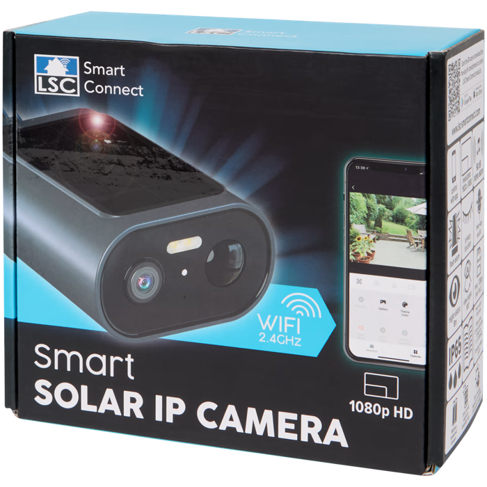

# LSC Smart Connect Solar IP Camera Toolkit

Tools for the Action / LSC Smart Connect solar IP camera, product `3222494`.
The goal is to keep the original Tuya stack working while adding local access:



- root shell over telnet
- RTSP stream on port `8554`
- ONVIF service on port `8899` plus WS-Discovery
- Tuya app still starts normally
- default tweaks for a cleaner local stream, including watermark off

This work started from
[tasarren/lsc-tuya-toolkit issue #16](https://github.com/tasarren/lsc-tuya-toolkit/issues/16)
for the
[LSC Smart Connect solar IP camera](https://www.action.com/nl-nl/p/3222494/lsc-smart-connect-solar-ip-camera/).

## Compatibility

Supports the Ingenic T23 based camera with firmware `6.2712.35` and
`6.2712.43`. Other LSC/Tuya cameras may use different firmware layouts or
boot behavior.

## Background

The investigation started with UART through an FT232RL USB-TTL adapter. It
exposed boot logs and a Linux login prompt, but the console was password
protected; the root password's DES `crypt(3)` hash was not cracked.

Dumping the SPI flash with a CH341A programmer, then unpacking and decrypting
the firmware, revealed the SD-card `tuya.dat` import path used by this toolkit.
OTA firmware can now be downloaded and decompiled directly.

## How it works

The SD-card `tuya.dat` import launches `firstboot.sh` once. It copies the
running Tuya executable from `/proc`, patches the SD-card copy for local
ONVIF hooks, and reboots into the SD-card factory bootstrap. The Tuya app
continues running alongside the local services.

## Safety

This repository intentionally does not include firmware dumps, keys, logs, or
proprietary Tuya binaries.

The patched Tuya binary lives on the SD card; the internal firmware binary is
not overwritten. The bootstrap does set the persistent factory-mode flag
`/config/fmode`, so do not assume that removing the SD card alone is enough to
restore the stock boot path. To revert, clear the flag from telnet, reboot, and
then remove the SD card:

```sh
rm -f /config/fmode
sync
reboot
```

Toolkit runtime logs are reset at boot and truncated in place if an individual
log grows beyond 256 KiB. Stock recordings under `DCIM/` are not deleted by the
toolkit and can still fill or corrupt a small SD card; use the app's recording
retention/format controls and keep reasonable free-space headroom.

On a low-power PIR wake, the ONVIF motion state is re-pulsed every 10 seconds
for the active motion window. This gives an NVR time to recreate its PullPoint
subscription after the camera boots instead of missing the initial transition.

## Firmware upgrades

The SD bootstrap preserves the current Tuya executable on each boot and
refreshes its patched SD-card copy when the firmware changes.

After running `./tools/compile.sh` and extracting another OTA, run the complete
compatibility check before using it on a camera:

```sh
./tools/check_stone_compat.sh /path/to/extracted/rootfs/stone/main
```

The check uses temporary copies to validate patching, bootstrap-gadget
discovery, and payload generation. If the firmware layout is unrecognized,
the bootstrap runs the stock executable unmodified; RTSP and ONVIF snapshots
may require updated patches.

### Download an OTA from Tuya

With [uv](https://docs.astral.sh/uv/) installed, run:

```sh
uv run tools/fetch_tuya_ota.py --email you@example.com --country 31
```

Use your account's country calling code, enter the password at the hidden
prompt, and select a camera. The script downloads the offered firmware to
`build/ota/`, checks available size/MD5 metadata, and prints its URL and SHA-256.

If no OTA is offered, it temporarily reports the previous patch version,
queries again, and restores the original version before downloading. It never
requests installation. If interrupted restoration leaves
`build/ota/restore.json`, rerun with the same account and output directory.

An offered OTA may differ from the installed firmware. SD bootstrap requires
the exact installed firmware's `stone/main`.

### Keep a camera awake from Smart Life

```sh
uv run tools/wake_tuya_camera.py --email you@example.com --country 31
```

Enter your password and select a camera, or pass `--device <device-id>`.
The helper keeps the camera awake through a WebRTC preview session, discarding
any media. Press **Ctrl+C** to disconnect and let it sleep. This consumes
battery power like live viewing in the app; rerun if the connection drops.

Requires a low-power camera with H.264 WebRTC support. Telnet, RTSP, and ONVIF
also require the SD payload to be installed and running.

### Reuse the Smart Life login

For repeated use, keep `TUYA_EMAIL`, `TUYA_PASSWORD`, and `TUYA_COUNTRY` in
the ignored repository-root `.env` file, with permissions set to `600`:

```sh
uv run --env-file .env tools/wake_tuya_camera.py
uv run --env-file .env tools/fetch_tuya_ota.py
```

`--email` and `--country` override the saved values.

## Prerequisites

- macOS or Linux host
- Docker, for the MIPS cross-compile environment
- FAT32 formatted SD card

## Build

```sh
./tools/compile.sh
```

This builds:

- `aic_filter`: opens TCP forwarding through the AIC Wi-Fi side.
- `stone_dump_relay`: turns the Tuya H264 dump stream into RTSP/raw H264.
- `onvif_cgi_httpd`: small HTTP wrapper for ONVIF SOAP requests.
- `patch_stone_main`: discovers and patches the relevant Tuya code by
  instruction context for ONVIF snapshots and can optionally disable the stock
  low-power branch.
- `onvif_simple_server`: handles ONVIF device/media SOAP calls.
- `onvif_notify_server`: tracks ONVIF event state for PullPoint subscriptions.
- `wsd_simple_server`: announces the camera via ONVIF WS-Discovery.

The build script fetches pinned upstream sources for
[OpenIPC/smolrtsp](https://github.com/OpenIPC/smolrtsp) and
[roleoroleo/onvif_simple_server](https://github.com/roleoroleo/onvif_simple_server).

## Prepare an SD card

Replace `/path/to/sd-card` with your mounted SD-card path.

```sh
./tools/build_tuya_dat_overflow.py \
  --stone-main /path/to/extracted/rootfs/stone/main \
  /path/to/sd-card
sync
```

Generating a trigger always requires the exact stock `stone/main` from the
firmware currently installed on the target camera. The builder validates the
overflow layout and discovers the matching bootstrap gadget; it has no raw
address or assumed-version escape hatch. The stock executable is only inspected
on the host and is not copied into the repository or generated payload.

Legacy cards may contain `tuya.dat.used`, a consumed firmware-specific trigger.
Never rename or copy it back to `tuya.dat`, especially after an OTA. Current
payloads delete the trigger as soon as firstboot starts, and the builder removes
legacy `.used` files. A cached `update.bin` identifies an available or downloaded
package, not necessarily the firmware currently installed. If factory mode must
be re-established, determine the installed version and regenerate `tuya.dat`
from that version's exact `stone/main` using the command above.

Insert the SD card and boot the camera. On success, the camera should expose:

- telnet root shell: `telnet <camera-ip> 2323`
- RTSP main stream: `rtsp://<camera-ip>:8554/main_ch`
- ONVIF service: `http://<camera-ip>:8899/onvif/device_service`
- raw H264 stream: `nc <camera-ip> 8555 > stream.h264`

Default ONVIF credentials:

```text
admin / admin
```

## Live update over the network

After telnet is working, you can update the SD-card files without physically
swapping the card.

Generate a fresh payload directory:

```sh
rm -rf /tmp/lsc-solar-payload
mkdir -p /tmp/lsc-solar-payload
./tools/build_tuya_dat_overflow.py --no-trigger /tmp/lsc-solar-payload
```

Low-power/PIR wake mode is the default. To build a high-power payload that
keeps the Linux side awake and uses the RTSP byte-motion fallback:

```sh
./tools/build_tuya_dat_overflow.py \
  --no-trigger --no-low-power \
  /tmp/lsc-solar-payload
```

Push it to the camera:

```sh
./tools/push_camera_live.py /tmp/lsc-solar-payload --camera-ip <camera-ip>
```

The live pusher serves small chunks over TFTP, drives the camera over telnet,
reassembles each file on the camera, verifies `md5sum`, then reboots by default.
It does not push `tuya.dat` during normal live updates; use `--include-trigger`
only when deliberately testing the first-boot trigger path.

## What the bootstrap changes

The SD bootstrap currently:

- on first boot, copies the running Tuya executable from `/proc` to
  `factory/stone-main.bin`
- on later boots, refreshes that copy when the internal firmware executable
  changes
- discovers and patches the SD-card copy for ONVIF snapshots and, if
  `--no-low-power` was used, to keep the Linux side awake
- sets `/config/fmode` only after the copy and patch succeed
- deletes the `tuya.dat` trigger as soon as firstboot starts
- keeps `/config/fmode` asserted
- starts telnet on port `2323`
- starts the RTSP relay on port `8554`
- starts ONVIF HTTP, WS-Discovery, and motion-event notification
- in low-power mode, feeds ONVIF motion from stock `stone-main.log` PIR events
- in high-power mode, feeds ONVIF motion from the RTSP relay's encoded-frame
  motion fallback
- applies AIC TCP forwarding filters
- starts the current Tuya process from the patched SD-card copy, or falls back
  to the unmodified internal copy when a future layout is not recognized
- sets these Tuya config values:
  - `tuya_hum_on_off=0`
  - `tuya_pir_on_off=1`
  - `tuya_pir_sens=1`
  - `tuya_record_time=2` (max stock PIR record time, about 31 seconds)
  - `tuya_flip_onoff=0`
  - `tuya_watermark_onoff=0`

## Repository layout

```text
tools/build_tuya_dat_overflow.py      SD payload builder
tools/check_stone_compat.sh           offline firmware compatibility check
tools/fetch_tuya_ota.py               Smart Life login and OTA downloader
tools/wake_tuya_camera.py             Smart Life wake and preview keep-awake helper
tools/push_camera_live.py             live network updater
tools/compile.sh                      Docker based MIPS build
tools/src/                            small camera-side helpers
tools/patches/                        ONVIF server portability patch
```

## Credits

This builds on prior LSC/Tuya camera work from:

- [tasarren/lsc-tuya-toolkit](https://github.com/tasarren/lsc-tuya-toolkit)
- [guino/LSCOutdoor1080P](https://github.com/guino/LSCOutdoor1080P)
- [OpenIPC/smolrtsp](https://github.com/OpenIPC/smolrtsp)
- [roleoroleo/onvif_simple_server](https://github.com/roleoroleo/onvif_simple_server)
